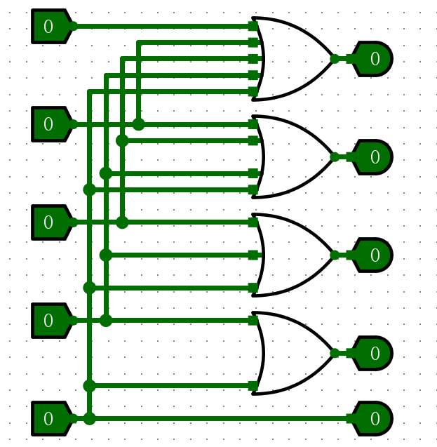
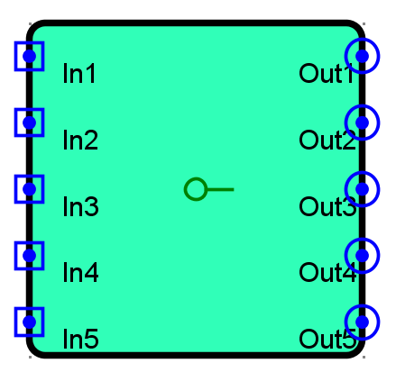
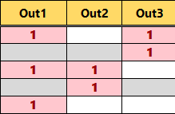
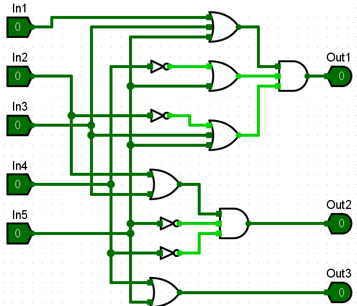
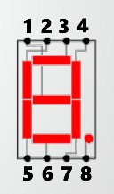
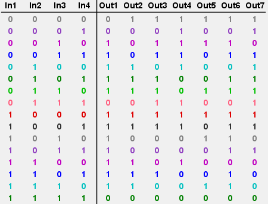
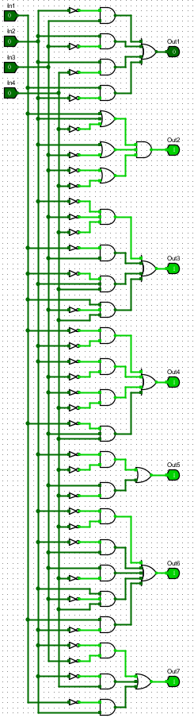
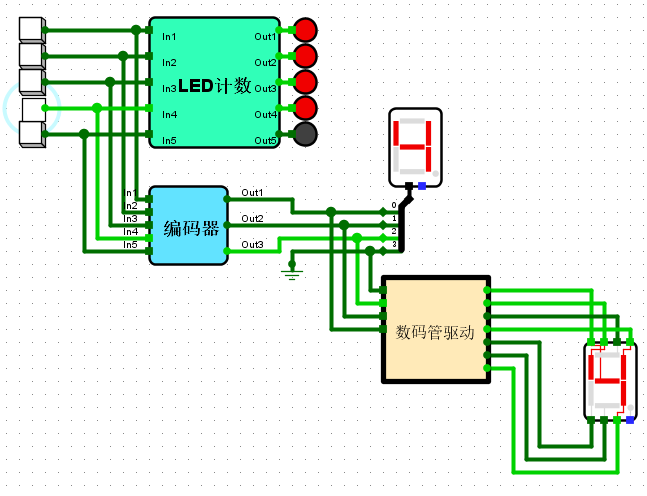
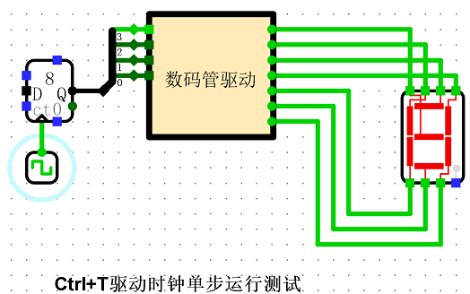

[toc]

# 新手上路实验记录

> 完成时间：2020.9.6

## LED计数电路

电路逻辑很简单，按几号，亮几个灯。





## 5输入按键编码器

本实验采用Excel脚本将真值表转换为逻辑表达式，接着使用Logisim自动生成电路的功能来构建该电路。




生成的逻辑表达式如下：

```text
Out1 = In5+In3&~In4&~In5+In1&~In2&~In3&~In4&~In5
Out2 = In3&~In4&~In5+In2&~In3&~In4&~In5
Out3 = In5+In4&~In5
```

输入Logisim后，自动生成电路如下：



电路与逻辑表达式存在区别，即转换为了或与形式，减少了门的数量。

## 数码管驱动

本实验采用logisim的真值表转换电路的功能。

数码管引脚与灯管的对应关系：



填写的真值表如下：



生成的电路如下所示：



## 测试结果





