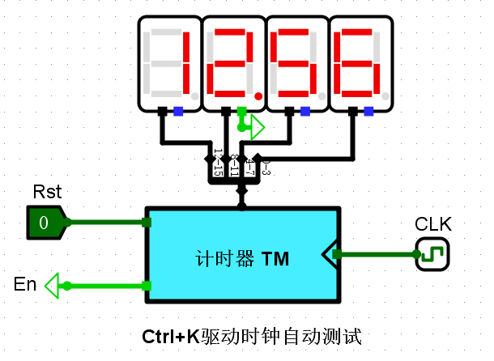

[toc]

# 数字逻辑基础实验

> 完成时间：2020.9.9

## 2路选择器

### 1位

输入：`X0`、`X1`、`Sel`

输出：`Out`

逻辑很简单：

```
Out = X0 & ~Sel + X1 & Sel
```


### 16位

输入：`X`、`Y`、`Sel`

输出：`Out`

逻辑同上，不过是要将`Sel`扩展为16位罢了。


### 测试结果


## 无符号比较器

### 1位

输入：`X`、`Y`

输出：`Greater`、`Equal`、`Less`

逻辑也很简单：

```
Greater = X & ~Y
Equal = ~(X ^ Y)
Less = ~X & Y
```


### 4位

输入：`X3 X2 X1 X0`、`Y3 Y2 Y1 Y0`

输出：`Greater`、`Equal`、`Less`

构成采用复用的形式，即使用4个1位无符号比较器`C3 C2 C1 C0`，分别用`G E L`表示1位无符号比较器输出大于、等于、小于信号，则有：

```
Greater = C3G + C3E & C2G + C3E & C2E & C1G + C3E & C2E & C1E & C0G
Equal = C3E & C2E & C1E & C0E
Less = C3L + C3E & C2L + C3E & C2E & C1L + C3E & C2E & C1E & C0L
```


### 16位

同理，使用四个4位比较器，并采用相同的逻辑输出即可。


### 测试结果


## 并行加载寄存器

### 4位

输入：`Din`，`CLK`，`En`

输出：`Q`

使能端`En`低电位有效，因此记得取非。总体而言只需要4个D触发器（下降沿）即可。


### 16位

并联四个4位寄存器即可，共用时钟端和使能端，输入端使用分线器从高到低分为四部分，输出也使用集线器从高到低集中为一条线。


## 码表计数器

### 状态转换模块

这个模块相当于将输入和输出建立一个映射关系，状态转换图如下：


因此直接填写真值表生成电路即可，注意无关状态的处理，应保证电路具有自启动功能。


### 输出函数模块

很简单，输出等于9时，即1001时输出为1，其余时间输出为0：

```
Cout = Q3 & ~Q2 & ~Q1 & Q0
```


### 4位BCD计数器

将以上模块和四个D触发器（上升沿）组合即可得到4位BCD计数器：

1. 状态转换模块作为`D3 D2 D1 D0`和`Q3 Q2 Q1 Q0`之间的桥梁。
2. 输出函数专门为`Cout`准备。
3. 使能端和时钟端使用与门来进行使能控制。


### 码表计数器

输出共16位，因此要使用四个4位BCD计数器进行串联，分别对应10秒，1秒，1/10秒，1/100秒。低位计数到9时，相邻高位在时钟到来时进1。注意这里BCD计数器使用的是上升沿D触发器，因此这里串联需要将进位信号取非，这样才能保证进位在下一个时钟脉冲到来时产生。


### 测试结果



## 运动码表

### 码表状态转换

状态图如下：


对状态图的几点分析：

1. 清零和复位属于短暂状态，因为他们均无条件转移。
2. 计时作为最主要的状态，也同样是最重要的中转状态。

状态编码如下：

| 状态名称 | 状态编码 |
| -------- | -------- |
| 复位     | 000      |
| 清零     | 001      |
| 计时     | 011      |
| 暂停     | 111      |
| 存储     | 110      |
| 显示     | 100      |

真值表：


### 码表输出函数

|          | 输出及说明 | SDSel          | SDEN           | DPSEL          | TMEn           | TMReset        |
| -------- | ---------- | -------------- | -------------- | -------------- | -------------- | -------------- |
| 状态名称 | 状态编码   | 寄存器存入选择 | 16位寄存器使能 | 数码管显示选择 | 时间计数器使能 | 时间计数器重置 |
| 复位     | 000        | 0              | 1              | 1              | 0              | 0              |
| 清零     | 001        | 0              | 0              | 1              | 0              | 1              |
| 计时     | 011        | 1              | 0              | 1              | 1              | 0              |
| 暂停     | 111        | 1              | 0              | 1              | 0              | 0              |
| 存储     | 110        | 1              | 1              | 1              | 1              | 0              |
| 显示     | 100        | 1              | 0              | 0              | 1              | 0              |

这里的输出需要根据状态和运动码表中控制信号的连接来确定。

### 码表显示驱动

将四个数码管驱动并联即可：


这里测试的时候出现了小问题，我的电路的输出和老师给的展示的网孔不匹配，因此修改了一下运动码表电路中的输出部分，即将SnT和SnB交换了位置，如下：


### 码表控制器

和4位BCD计数器相同的设计思想，这里不过多赘述。


### 运动码表控制信号


### 测试结果

