[toc]

# 数据表示实验

## 国标转区位码

已知区位码转国标码公式如下：
$$
区位码 + (A0A0)_{16} = 国标码 
$$
因此只需要加上`0xA0A0`的补码`0x5F60`即可。

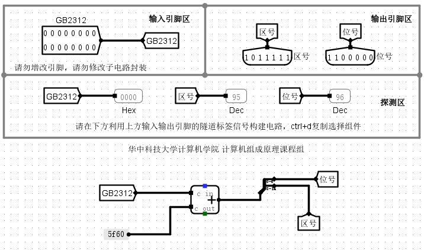

## 汉字显示

国标转区位码的电路已经实现，只需要写一个小程序来讲汉字转换为国标码即可，因为Python转码比较简单，相关程序如下：

```python
str2 = "１２３４５ＡＢＣＤＥＦＧａｂｃｄｅｆｇ轻轻的我走了，正如我轻轻的来；我轻轻的招手，作别西天的云彩。那河畔的金柳，是夕阳中的新娘；波光里的艳影，在我的心头荡漾。"
# 输入必须是圆角字符
str = str2.encode("GB2312")
with open("output", "w") as f:
    print("v2.0 raw", file = f) # 方便Logisim直接导入
    i = 0
    while i <= len(str):
        print(str[i:i+2].hex(), end=' ', file=f)
        i = i + 2
```

输出如下：

```text
v2.0 raw
a3b1 a3b2 a3b3 a3b4 a3b5 a3c1 a3c2 a3c3 a3c4 a3c5 a3c6 a3c7 a3e1 a3e2 a3e3 a3e4 a3e5 a3e6 a3e7 c7e1 c7e1 b5c4 ced2 d7df c1cb a3ac d5fd c8e7 ced2 c7e1 c7e1 b5c4 c0b4 a3bb ced2 c7e1 c7e1 b5c4 d5d0 cad6 a3ac d7f7 b1f0 cef7 ccec b5c4 d4c6 b2ca a1a3 c4c7 bad3 c5cf b5c4 bdf0 c1f8 a3ac cac7 cfa6 d1f4 d6d0 b5c4 d0c2 c4ef a3bb b2a8 b9e2 c0ef b5c4 d1de d3b0 a3ac d4da ced2 b5c4 d0c4 cdb7 b5b4 d1fa a1a3  
```

### 测试结果

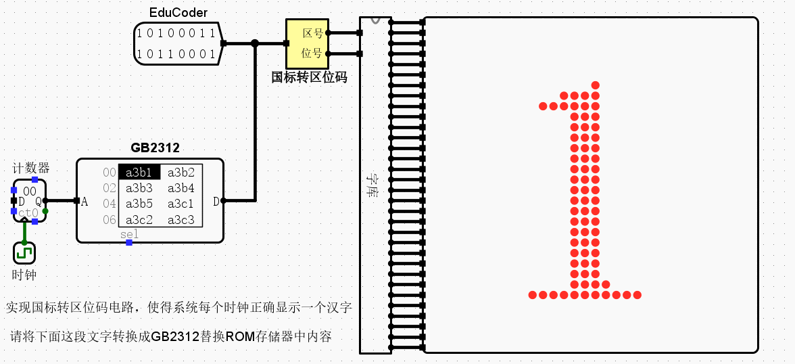

## 偶校验码

### 偶校验码的编码与校验

偶校验原理很简单，保证编码后1的个数为偶数个即可，换成逻辑表示即为编码逐位异或所得结果为0即可，据此有偶校验位的生成公式和校验公式：
$$
P = D_1\oplus D_2\oplus \cdots \oplus D_n\\
G = P\oplus D_1 \oplus \cdots \oplus D_n
$$
偶校验编码电路如下：

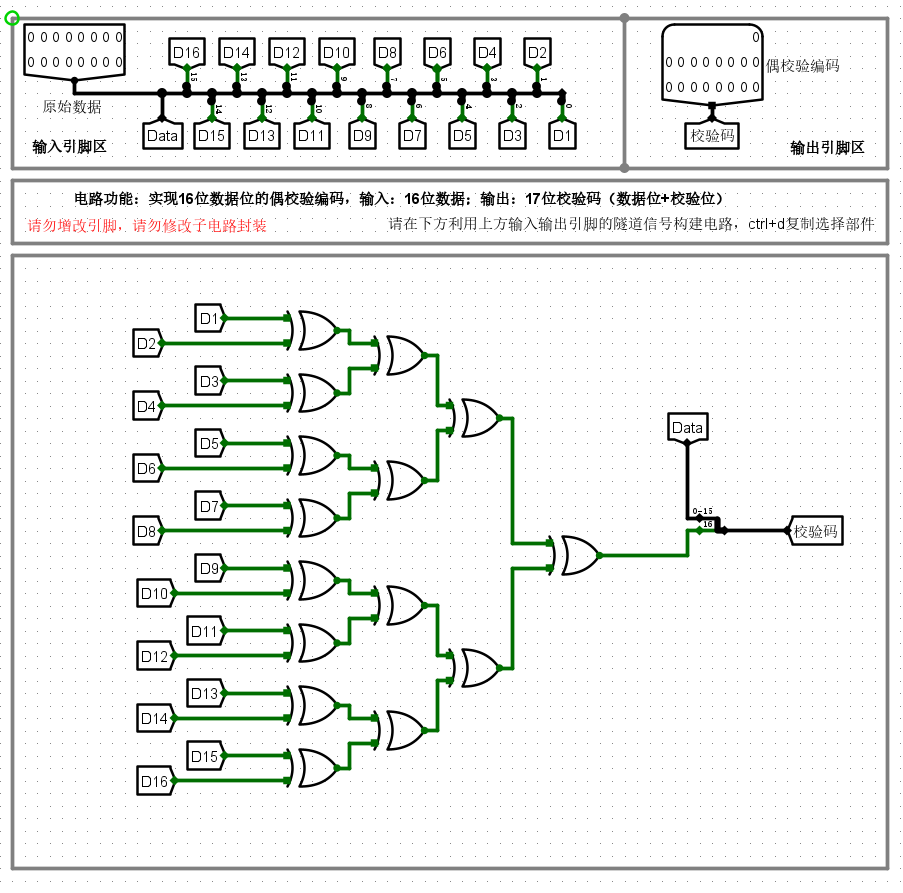

偶校验解码电路如下：

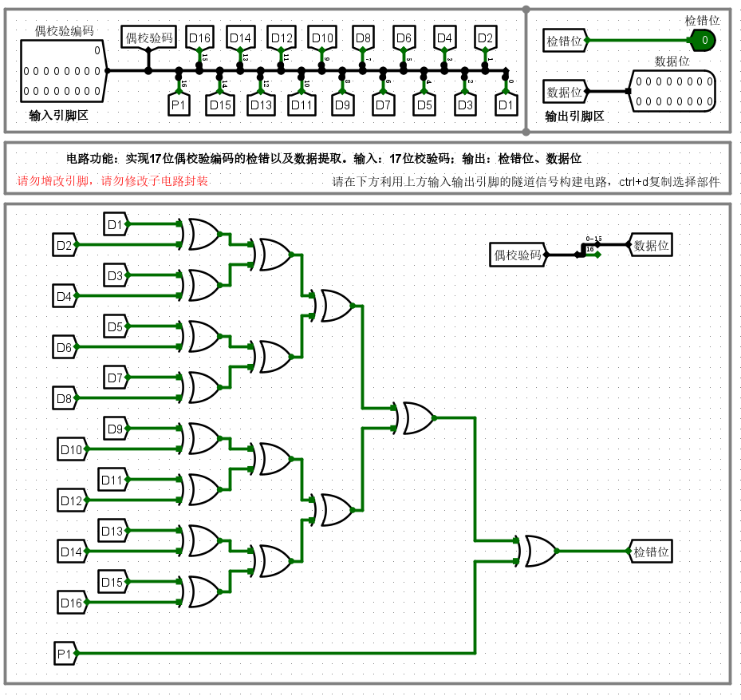

### 测试结果

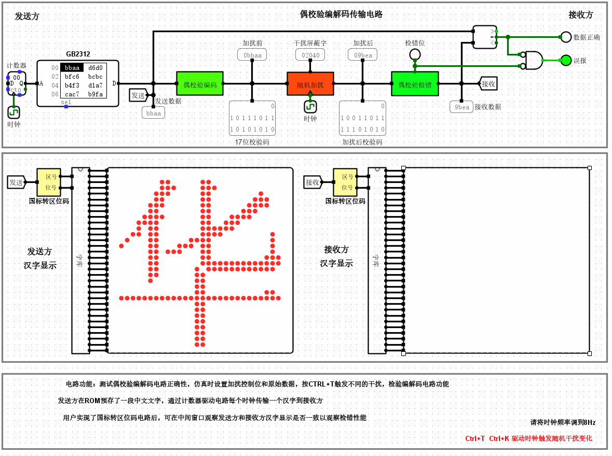

## 海明编码

### 海明编码的编码与校验

十六位数据的海明编码表格如下：

| 编码位 | H1   | H2   | H3   | H4   | H5   | H6   | H7   | H8   | H9   | H10  | H11  | H12  | H13  | H14  | H15  | H16  | H17  | H18  | H19  | H20  | H21  | H22  |
| ------ | ---- | ---- | ---- | ---- | ---- | ---- | ---- | ---- | ---- | ---- | ---- | ---- | ---- | ---- | ---- | ---- | ---- | ---- | ---- | ---- | ---- | ---- |
| 校验位 | P1   | P2   | D1   | P3   | D2   | D3   | D4   | P4   | D5   | D6   | D7   | D8   | D9   | D10  | D11  | P5   | D12  | D13  | D14  | D15  | D16  | P6   |
| G1     | 1    |      | 1    |      | 1    |      | 1    |      | 1    |      | 1    |      | 1    |      | 1    |      | 1    |      | 1    |      | 1    |      |
| G2     |      | 1    | 1    |      |      | 1    | 1    |      |      | 1    | 1    |      |      | 1    | 1    |      |      | 1    | 1    |      |      |      |
| G3     |      |      |      | 1    | 1    | 1    | 1    |      |      |      |      | 1    | 1    | 1    | 1    |      |      |      |      | 1    | 1    |      |
| G4     |      |      |      |      |      |      |      | 1    | 1    | 1    | 1    | 1    | 1    | 1    | 1    |      |      |      |      |      |      |      |
| G5     |      |      |      |      |      |      |      |      |      |      |      |      |      |      |      | 1    | 1    | 1    | 1    | 1    | 1    |      |
| G6     |      |      |      |      |      |      |      |      |      |      |      |      |      |      |      |      |      |      |      |      |      | 1    |

编码步骤如下：

1. 首先海明编码的2的幂次的位置，即$H_{2^n}, n = 0,1,2,\ldots$，作为海明校验码。

2. 然后剩余的位置依次填进数据位，如上表格所示，最终编码序列为$H_1H_2H_3H_4H_5H_6H_7H_8H_9\ldots=P_1P_2D_1P_3D_2D_3D_4P_4D_5\ldots$。

3. 接着像上面表格中显示的一样，由低到高竖着写出下标的二进制表示。

4. 根据每一位的二进制表示，则有：
   $$
   P_i=\sum_k H_k(H_k\ne P_k,k\&2^i=2^i,\&表示按位与,\sum表示连续异或)\\
   G_i=\sum_k H_k(k\&2^i=2^i)
   $$

5. 为了能够区分奇数位错和偶数位错，这里加入了总偶校验码，生成和解码方式同偶校验码。

在保证没有3位及以上错的情况下，依据校验码可以实现一位错的纠错和两位错的检错。基本逻辑如下：

- 如果海明校验位全为0，且总偶校验位为0，则没有错；
- 如果总偶校验位为1，则有一位错；
- 如果总偶校验位为0，且海明校验位不全为0，则有两位错。

一位错纠错方法如下：

由海明校验码的生成可知，其校验码角码由低至高排列获取的二进制数即为出错位，因此只需要使用解码器生成相应的掩码，并于原海明码相异或即可纠错成功。

编码电路如下：

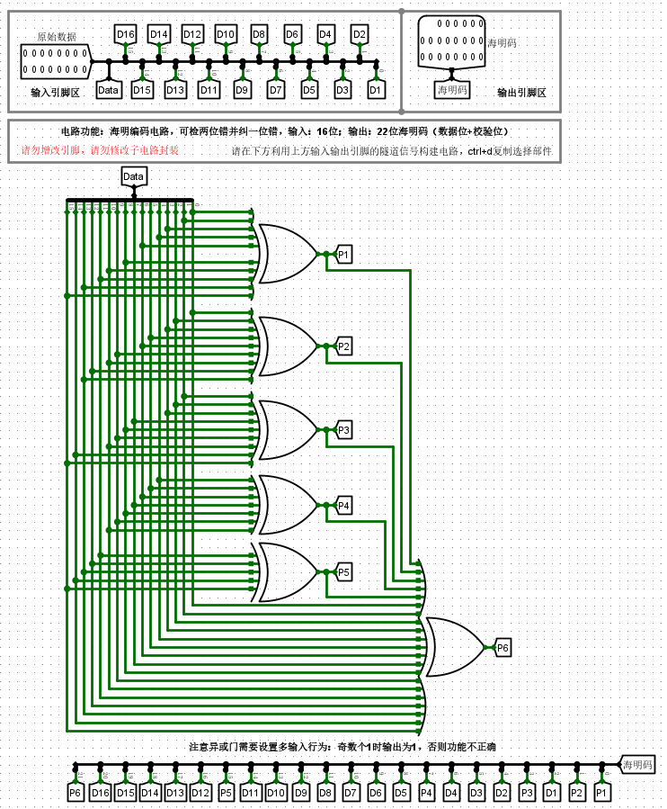

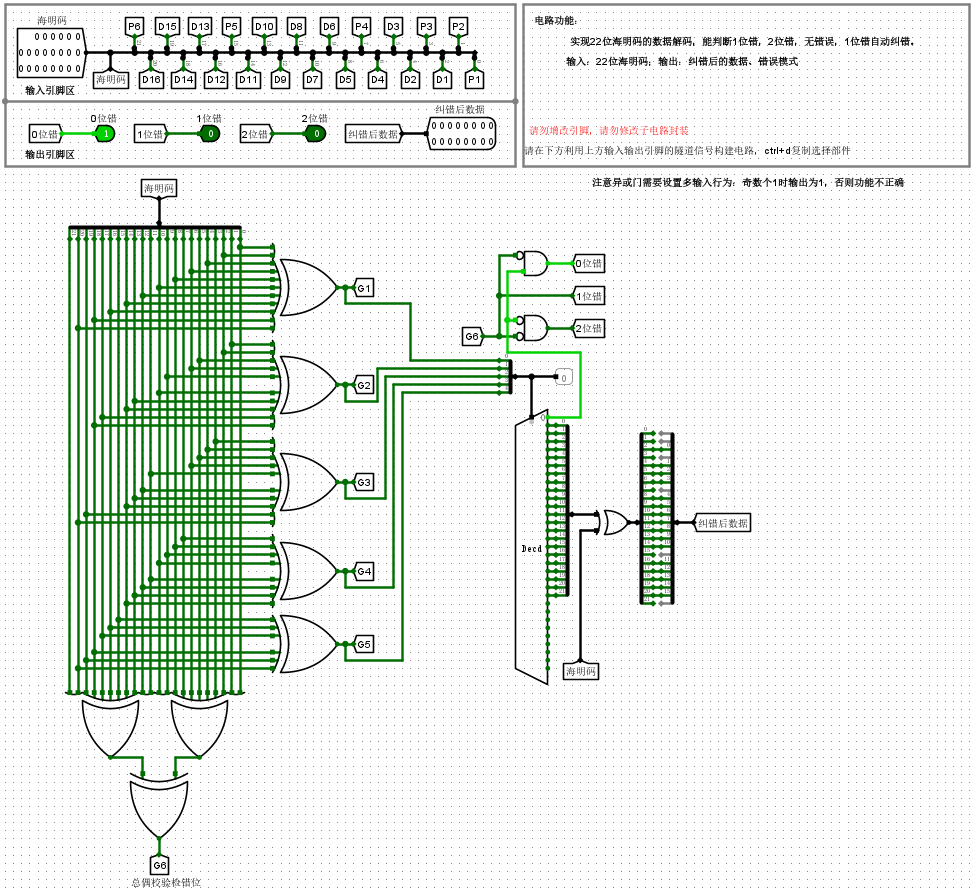

### 测试结果

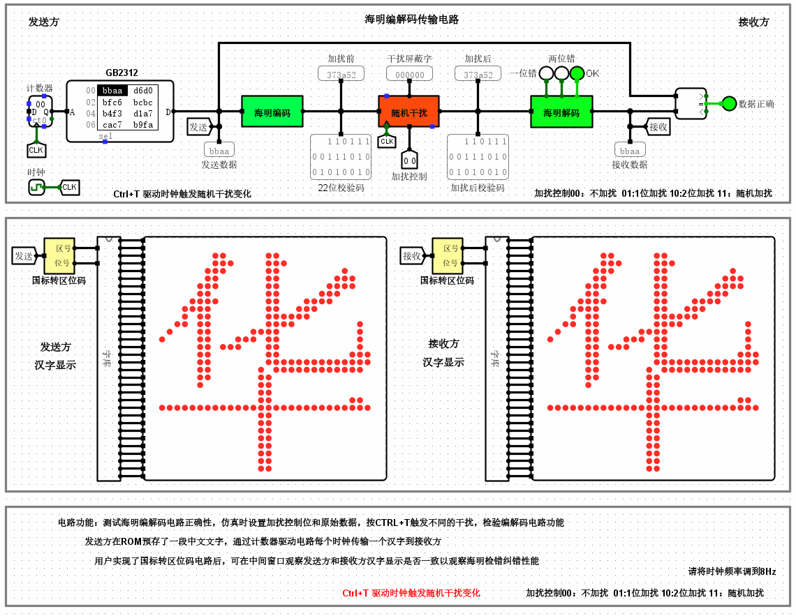

## CRC编码

### CRC编码的编码与校验

CRC编解码需要用到模2运算，这里需要指出的是，手算模2除法本身是一个串行算法，因此反映到电路上来就是一个串行同步电路的实现，如下图所示：

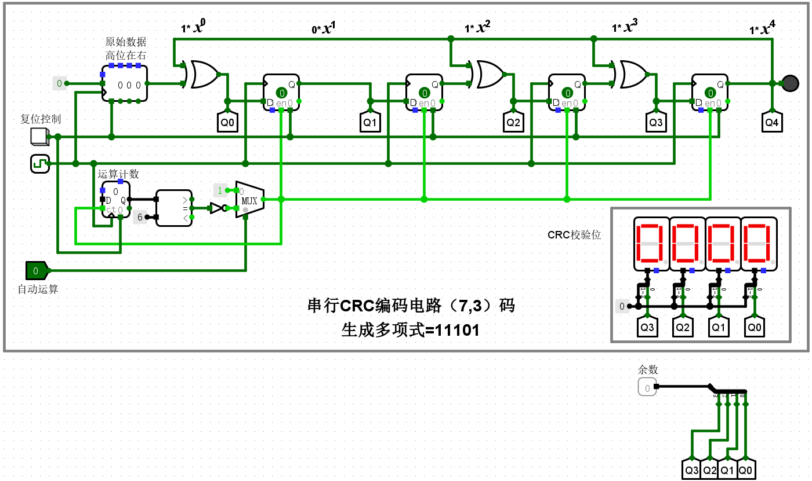

当数据位数一大，这样的编码效率很低，因此需要改进为并行电路，这里给出并行的理论依据：**模2除法余数运算满足结合律**，即：
$$
( D(x) \% G(x) ) \oplus (D'(x)\% G(x)) = (D(x) \oplus D'(x))\% G(x)
$$
据此，我们可以将输入数据按位分解成2的幂次，然后分别计算其与生成多项式的模2除法的余数，最后一并相异或即可。

改进后并行编码步骤如下：

- 首先提前计算好每一位对生成多项式的模2除法余数即$2^i\% G(x)$，作为常量置于电路中。
- 然后将输入数据的各位作为选择端接入各自的多路选择器，被选择的两个输入分别为相应的余数和0。
- 最后将所有选择器输出全部异或所得即为校验位，按照CRC编码组合方式即可获得最终编码。
- 同理，为了能够区分奇数位错和偶数位错，加入了总偶校验码，生成和解码方式同偶校验码。

CRC检错原理如下，为了能够区分奇数位错和偶数位错，这里加入了总偶校验码，生成和解码方式同偶校验码。在保证没有3位及以上错的情况下，依据校验码可以实现一位错的纠错和两位错的检错。基本逻辑如下：

- 如果总偶校验为0，且校验码不全为0，则说明出现两位错；
- 如果总偶校验为1且校验码不全为1，或者总偶校验出错，则说明出现一位错；
- 如果总偶校验没出错，且校验码不全为1，则说明没有出错。

CRC一位错的纠错方法很简单，只需要将编码的电路复制一份即可，需要修改的一点是，数据位异或所得结果要与校验位组成的二进制数进行异或，这样才能得到错误的位数，原理如下：

设数据为$D$，生成多项式为$G$，$D$模2除$G$所得余数为$R$，按照编码规则可知，编码为$C = D\cdot 2^r + R$，其中$r$为余数位数。那么假设原数据的第$i$位出错，出错数据为$D'$，则有$D'\%G = (D\oplus2^i)\%G=D\%G\oplus 2^i\%G=R\oplus 2^i\% G\Rightarrow 2^i\%G = D'\%G\oplus R$，比对结果与哪一个2的幂次与生成多项式的模2除法相等，则说明哪一位出错。

CRC编码电路如下：

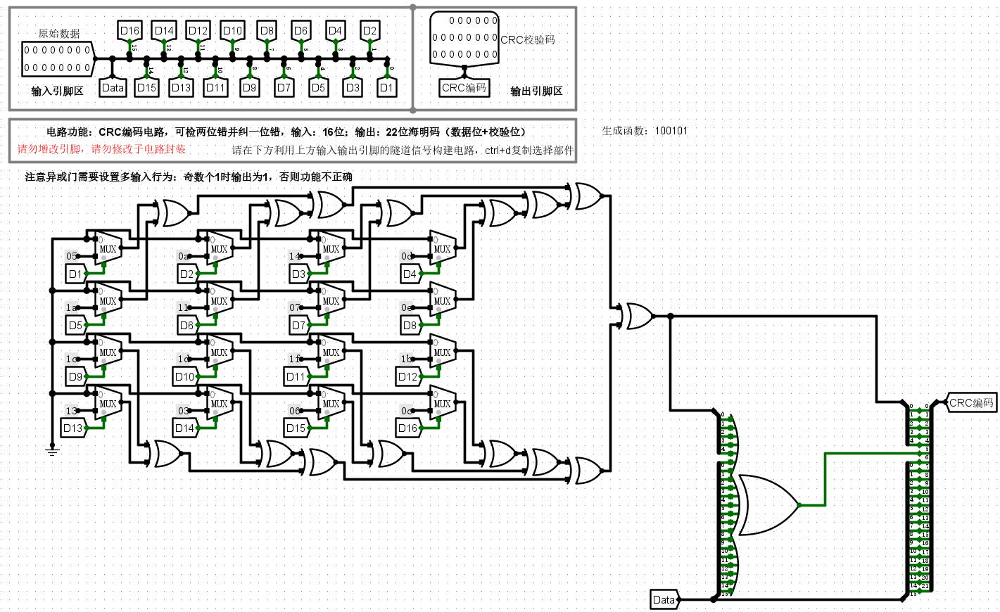

CRC阶码电路如下：

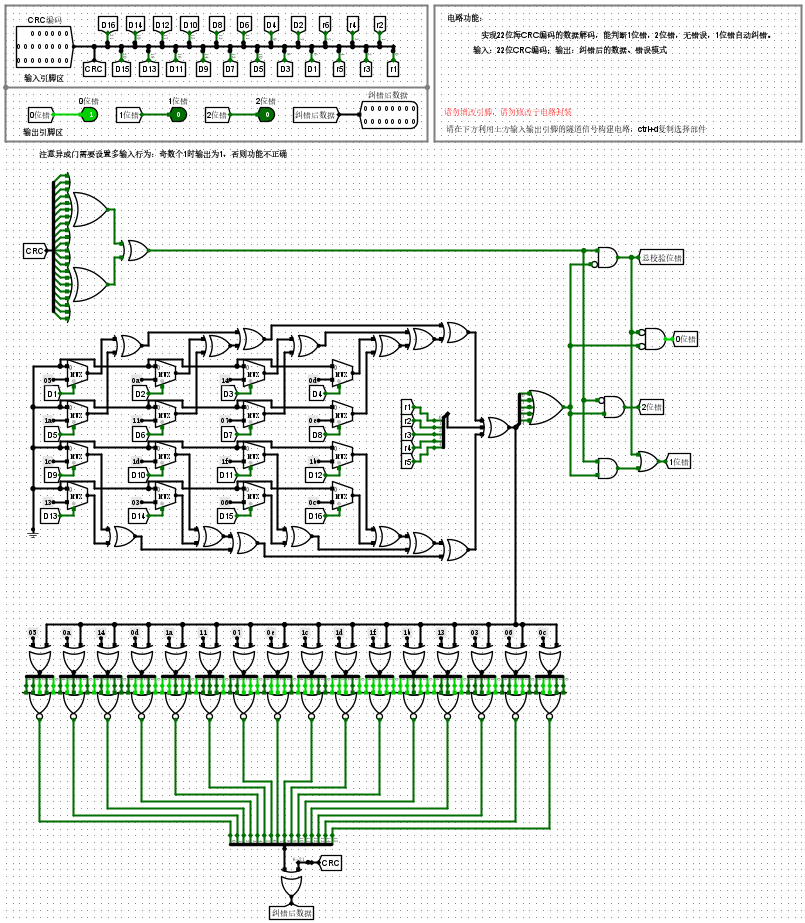

### 测试结果

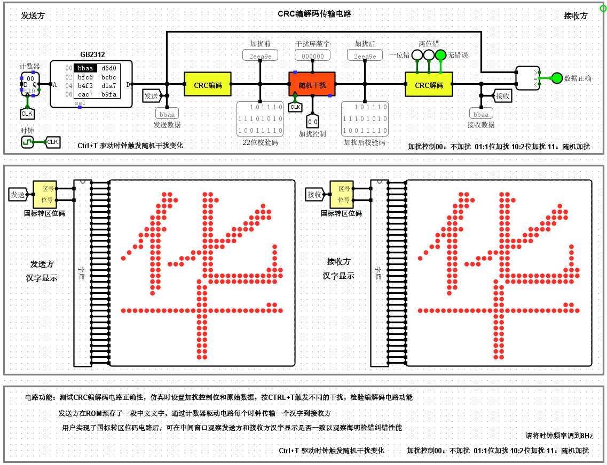

## 流水传输

流水传输主要解决的问题是数据重传和显示阻塞，需要考虑的方面有：

1. 数据是否传入。
2. 数据是否有两位错。

如果上述两个方面皆满足，则需要回传数据重传信号，使得各级流水寄存器清零，并将当前处理器地址回滚3（因为阶码阶段和取数阶段中间延迟了三级）。

如果没有传入数据或者传入数据出现两位错，则显示阶段应保持原值，阻塞输入。

根据以上逻辑，分别用一个与门和选择器来实现重传信号，一个或门实现显示阻塞，电路如下：

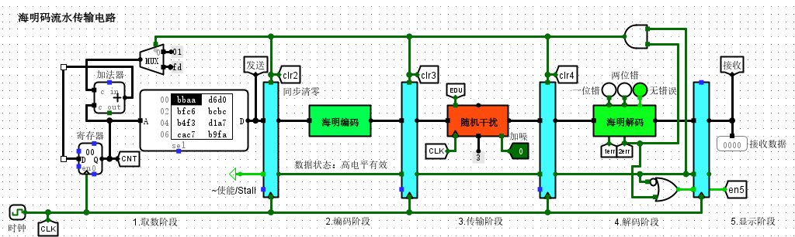

### 测试结果

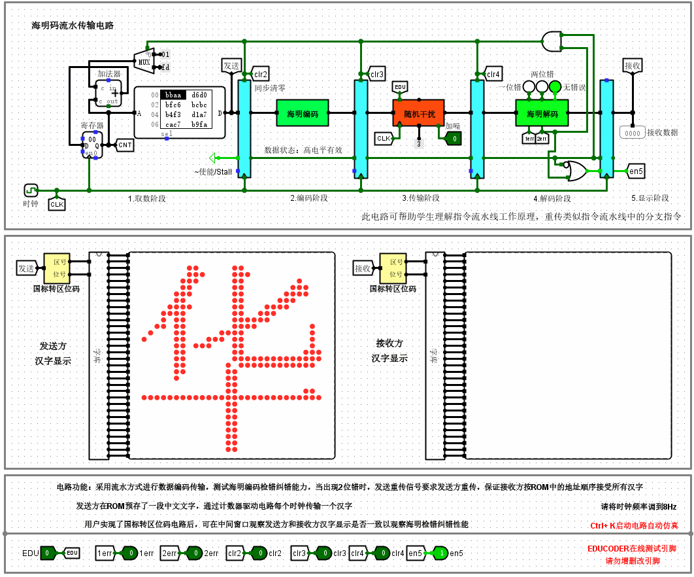