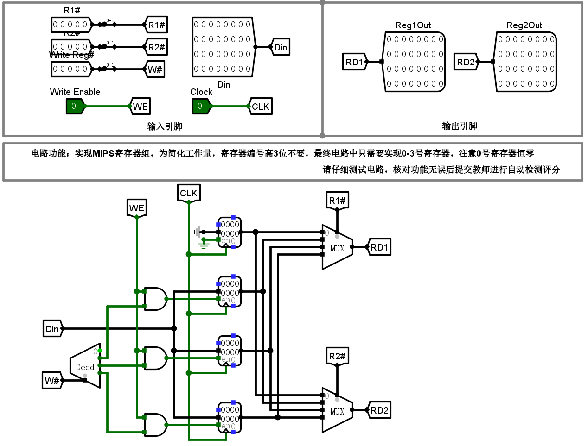

[TOC]

# 存储系统实验

## 字库扩展

字库电路做的是字数扩展（扩展数据总线），用八片$16 K\times 32$的ROM得到一个字库芯片（输出$256$位）。

实验内容要求我们用四片$4K\times 32$的ROM来进行字长扩展（扩展地址总线），得到一片$16K\times 32$的ROM。

注意：字库文件的分割是按顺序分成四份，而不是等分四份。

因此，使用高$2$位进行片选，低$14$位作为片内地址，使用解码器进行使能控制（也可以使用多路选择器在输出端进行选择输出），具体电路如下图所示：

## MIPS RAM实验

功能要求：

| 信号   | 输入/输出 | 位宽 | 功能描述                                                     |
| ------ | --------- | ---- | ------------------------------------------------------------ |
| $Addr$ | 输入      | 12   | 字节地址输入（字访问时忽略最低两位，半字访问时忽略最低位，倒数第二位片选，字节访问时，低两位进行片选） |
| $Din$  | 输入      | 32   | 写入数据（不同访问模式有效数据均存放在最低位，高位忽略）     |
| $Mode$ | 输入      | 2    | 访问模式控制位（00表示字访问，01 表示2字节访问，10表示1字节访问） |
| $WE$   | 输入      | 1    | 写使能，1 表示写入，0 表示读出                               |
| $Dout$ | 输出      | 32   | 读出数据 （不同访问模式有效数据均存放在最低位，高位补零）    |

首先，对输入的地址进行处理，如下：

$saddr$为字节地址$addr$的高10位，对应字节地址指向的字节所在字的起始位置。$se$为低2位，表示该字节在该字内的偏移。

使用解码器将该字节位置标出，对应每一种$Mode$给出不同的选择信号。

1. 如果是字访问，则全选（$sel_i = 1$）
2. 如果是两字节访问，则给出所在高两字节还是低两字节的选择信号。
3. 如果是字节访问，则只给出对应字节的选择信号。

接着，对输入数据$Din$进行操作，根据模式（多路选择器）给出各个字节的写入数据。

然后，对输出逻辑进行完善，注意对齐方式。

## MIPS Regfile

## Cache

### 直接相联

首先将字节地址划分，低2位为块内偏移$offset$，接着3位为行索引$index$，剩余11位为查找标记$tag$，使用解码器将$index$转换为行选信号。

对于Cache的一行有，有效位$valid$，查找标记位$tag$，块数据$data$。有效位和标记位合二为一进行比较，从而判断是否命中。

如果命中，则直接根据偏移选择输出。未命中则$Miss$信号高电平输出，等待外部调入主存块，当主存块调入时，$Blk$和$BlkReady$信号有效，此时将行选信号作为使能信号，将数据载入，有效位置为1，正常输出所需字节。

### 全相联

因为全相联中，主存块可以放在任意行，因此不需要行索引，这里除了低2位为块内偏移，其余均为均为查找标记。

对于Cache的一行有，有效位$valid$，查找标记位$tag$，块数据$data$，置换计数$cnt$。这里所有行进行并发比较，查找所需行。

比较器输出的便是行选信号，如果命中，则直接输出，如果没有命中，则等待外部调入主存块。调入成功，信号同上，但内部需要同时需要给出行替换信号$Write_i$。

如果有空行，则利用$valid$位和优先编码器来获取第一个空行行号（这里的优先级自己定，图中所示的优先级是按行号从大至小）。

如果没有空行，则利用$cnt$位和归并比较器，来给出最近最少使用的行的序号（这里使用的是LRU算法）。

之后再利用解复用器给出行替换信号即可。

### 二路组相联

二路组相联和四路组相联基本一致，这里只记录四路组相联。

### 四路组相联

全相联的性能好，但是替换算法和并发比较开销太大；直接相联器间少，但是性能差，因此组相联的意义在于综合二者，于是组相联的思想为：组内全相联，组间直接相联。

如上，2位块内偏移，1位组选择信号（四路，即四行一组，八行共两组），其余13位为查找标记位。

Cache的每一行与全相联的一样，这里不再赘述。

如下为行选电路：

$vt_i$信号为每一行的$valid$信号和$tag$信号，这里进行被选中组内的四路并发比较，获得组内命中信号$n_i$，进而配合组选信号$g_i$，获取行选信号$l_i$。

如果选中，则直接根据命中信号输出数据。

如果没有选中，则根据空行或淘汰行信号进行替换（这两个信号都是2位的，因此要加上组索引）。

空行信号的生成如下图所示，利用选中的组内有效位进行优先编码。

淘汰行信号的生成如下图所示，利用选中组内的归并比较给出。

注意，因为组相联的电路比较庞大，存在毛刺，即如果直接将行选信号当作淘汰计数器的清零信号会导致淘汰错误，因此这里需要使用一个D触发器来去除。