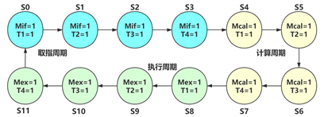
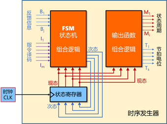

[TOC]

# 单总线CPU实验

# 定长指令周期3级时序

## MIPS指令译码设计

利用比较器将32位MIPS指令译码生成相应指令的信号即可。


各种指令对应的格式如下：


## 定长指令周期——时序发生器有限状态机设计

利用数字逻辑电路相关知识设计定长指令周期的三级时序系统，时序发生器包括状态机和输出函数两部分，本实验要求设计状态机。



状态转换图如上，实际上是一个模12计数器，填表如下：


因为定长指令周期，对于所有的指令来说都是一样的，所以不需要指令输入信号。

## 定长指令周期——时序发生器输出函数设计

利用数字逻辑电路相关知识设计定长指令周期的三级时序系统，时序发生器包括状态机和输出函数两部分，上一关已经实现了FSM状态机逻辑，本实验要求设计实现输出函数组合逻辑。



依据上个实验中的状态图的输出，可以得到下表：


## 硬布线控制器组合逻辑单元

硬布线控制器组合逻辑单元如下：


具体工作便是填写相应的微操作控制信号序列表，然后自动生成电路即可：


## 定长指令周期——硬布线控制器设计

组合上述逻辑控制单元、输出函数、有限状态机即可：


需要注意的一个重点：


**状态寄存器需要设置为下降沿！**

预期的下降沿信号如下：

```
Cnt    Instr        equal M123    T1234    cBus       ErrBit
00     2010ffff     0     100     1000     202400     xx
01     2010ffff     0     100     0100     000008     xx
02     2010ffff     0     100     0010     085002     xx
03     2010ffff     0     100     0001     100100     xx
04     2010ffff     0     010     1000     000000     xx
05     2010ffff     0     010     0100     000000     xx
06     2010ffff     0     010     0010     000000     xx
07     0274402a     0     010     0001     000000     xx
08     0274402a     0     001     1000     040400     xx
09     0274402a     0     001     0100     040044     xx
0a     0274402a     0     001     0010     080220     xx
0b     0274402a     0     001     0001     000000     xx
0c     0274402a     0     100     1000     202400     xx
0d     0274402a     0     100     0100     000008     xx
0e     ae300200     0     100     0010     085002     xx
0f     ae300200     0     100     0001     100100     xx
10     ae300200     0     010     1000     040400     xx
11     ae300200     0     010     0100     020010     xx
12     ae300200     0     010     0010     000000     xx
13     ae300200     0     010     0001     000000     xx
14     ae300200     0     001     1000     082000     xx
15     ae300200     0     001     0100     040840     xx
16     ae300200     0     001     0010     008001     xx
17     8e130200     0     001     0001     000000     xx
18     8e130200     0     100     1000     202400     xx
19     8e130200     0     100     0100     000008     xx
1a     8e130200     0     100     0010     085002     xx
1b     8e130200     0     100     0001     100100     xx
1c     8e130200     0     010     1000     040400     xx
1d     8e130200     0     010     0100     020010     xx
1e     8e130200     0     010     0010     000000     xx
1f     8e130200     0     010     0001     000000     xx
20     1000ffff     0     001     1000     200400     xx
21     1000ffff     0     001     0100     010010     xx
22     1000ffff     0     001     0010     000000     xx
23     1000ffff     0     001     0001     000000     xx
24     1000ffff     0     100     1000     202400     xx
25     1000ffff     0     100     0100     000008     xx
26     1000ffff     0     100     0010     085002     xx
27     1000ffff     0     100     0001     100100     xx
28     1000ffff     1     010     1000     040400     xx
29     2010ffff     1     010     0100     000000     xx
2a     2010ffff     1     010     0010     000000     xx
2b     2010ffff     1     010     0001     000000     xx
2c     2010ffff     1     001     1000     040400     xx
2d     2010ffff     1     001     0100     020010     xx
2e     2010ffff     1     001     0010     080200     xx
2f     2010ffff     1     001     0001     000000     xx
30     0274402a     1     100     1000     202400     xx
31     0274402a     1     100     0100     000008     xx
32     0274402a     1     100     0010     085002     xx
33     0274402a     1     100     0001     100100     xx
34     0274402a     1     010     1000     000000     xx
35     0274402a     1     010     0100     000000     xx
36     0274402a     1     010     0010     000000     xx
37     ae300200     1     010     0001     000000     xx
38     ae300200     1     001     1000     082000     xx
39     ae300200     1     001     0100     040840     xx
3a     ae300200     1     001     0010     008001     xx
3b     ae300200     1     001     0001     000000     xx
3c     ae300200     1     100     1000     202400     xx
3d     ae300200     1     100     0100     000008     xx
3e     ae300200     1     100     0010     085002     xx
3f     ae300200     1     100     0001     100100     xx
40     8e130200     1     010     1000     040400     xx
41     8e130200     1     010     0100     020010     xx
42     8e130200     1     010     0010     000000     xx
43     8e130200     1     010     0001     000000     xx
44     8e130200     1     001     1000     082000     xx
45     8e130200     1     001     0100     001002     xx
46     8e130200     1     001     0010     100200     xx
47     8e130200     1     001     0001     000000     xx
48     8e130200     1     100     1000     202400     xx
49     1000ffff     1     100     0100     000008     xx
4a     1000ffff     1     100     0010     085002     xx
4b     1000ffff     1     100     0001     100100     xx
4c     1000ffff     1     010     1000     040400     xx
4d     1000ffff     1     010     0100     0400c0     xx
4e     1000ffff     1     010     0010     000000     xx
4f     1000ffff     1     010     0001     000000     xx
50     1000ffff     1     001     1000     200400     xx
51     1000ffff     1     001     0100     010010     xx
```

如果修改为上升沿，信号如下（标注`Error!`的行）：

```
Cnt    Instr        equal M123    T1234    cBus       ErrBit
00     2010ffff     0     100     1000     202400     xx
00     2010ffff     0     100     0100     000008     15    Error!
01     2010ffff     0     100     0100     000008     xx
01     2010ffff     0     100     0010     085002     13    Error!
02     2010ffff     0     100     0010     085002     xx
02     2010ffff     0     100     0001     100100     14    Error!
03     2010ffff     0     100     0001     100100     xx
03     2010ffff     0     010     1000     000000     14    Error!
04     2010ffff     0     010     1000     000000     xx
04     2010ffff     0     010     0100     000000     xx    Error!
05     2010ffff     0     010     0100     000000     xx
05     2010ffff     0     010     0010     000000     xx    Error!
06     2010ffff     0     010     0010     000000     xx
06     2010ffff     0     010     0001     000000     xx    Error!
07     0274402a     0     010     0001     000000     xx
07     0274402a     0     001     1000     040400     12    Error!
08     0274402a     0     001     1000     040400     xx
08     0274402a     0     001     0100     040044     0a    Error!
09     0274402a     0     001     0100     040044     xx
09     0274402a     0     001     0010     080220     13    Error!
0a     0274402a     0     001     0010     080220     xx
0a     0274402a     0     001     0001     000000     13    Error!
0b     0274402a     0     001     0001     000000     xx
0b     0274402a     0     100     1000     202400     15    Error!
0c     0274402a     0     100     1000     202400     xx
0c     0274402a     0     100     0100     000008     15    Error!
0d     0274402a     0     100     0100     000008     xx
0d     0274402a     0     100     0010     085002     13    Error!
0e     ae300200     0     100     0010     085002     xx
0e     ae300200     0     100     0001     100100     14    Error!
0f     ae300200     0     100     0001     100100     xx
0f     ae300200     0     010     1000     040400     14    Error!
10     ae300200     0     010     1000     040400     xx
10     ae300200     0     010     0100     020010     12    Error!
11     ae300200     0     010     0100     020010     xx
11     ae300200     0     010     0010     000000     11    Error!
12     ae300200     0     010     0010     000000     xx
12     ae300200     0     010     0001     000000     xx    Error!
13     ae300200     0     010     0001     000000     xx
13     ae300200     0     001     1000     082000     13    Error!
14     ae300200     0     001     1000     082000     xx
14     ae300200     0     001     0100     040840     13    Error!
15     ae300200     0     001     0100     040840     xx
15     ae300200     0     001     0010     008001     12    Error!
16     ae300200     0     001     0010     008001     xx
16     ae300200     0     001     0001     000000     0f    Error!
17     8e130200     0     001     0001     000000     xx
17     8e130200     0     100     1000     202400     15    Error!
18     8e130200     0     100     1000     202400     xx
18     8e130200     0     100     0100     000008     15    Error!
19     8e130200     0     100     0100     000008     xx
19     8e130200     0     100     0010     085002     13    Error!
1a     8e130200     0     100     0010     085002     xx
1a     8e130200     0     100     0001     100100     14    Error!
1b     8e130200     0     100     0001     100100     xx
1b     8e130200     0     010     1000     040400     14    Error!
1c     8e130200     0     010     1000     040400     xx
1c     8e130200     0     010     0100     020010     12    Error!
1d     8e130200     0     010     0100     020010     xx
1d     8e130200     0     010     0010     000000     11    Error!
1e     8e130200     0     010     0010     000000     xx
1e     8e130200     0     010     0001     000000     xx    Error!
1f     8e130200     0     010     0001     000000     xx
1f     8e130200     0     001     1000     082000     13    Error!
20     1000ffff     0     001     1000     200400     xx
20     1000ffff     0     001     0100     010010     15    Error!
21     1000ffff     0     001     0100     010010     xx
21     1000ffff     0     001     0010     000000     10    Error!
22     1000ffff     0     001     0010     000000     xx
22     1000ffff     0     001     0001     000000     xx    Error!
23     1000ffff     0     001     0001     000000     xx
23     1000ffff     0     100     1000     202400     15    Error!
24     1000ffff     0     100     1000     202400     xx
24     1000ffff     0     100     0100     000008     15    Error!
25     1000ffff     0     100     0100     000008     xx
25     1000ffff     0     100     0010     085002     13    Error!
26     1000ffff     0     100     0010     085002     xx
26     1000ffff     0     100     0001     100100     14    Error!
27     1000ffff     0     100     0001     100100     xx
27     1000ffff     0     010     1000     040400     14    Error!
28     1000ffff     1     010     1000     040400     xx
28     1000ffff     1     010     0100     0400c0     0a    Error!
29     2010ffff     1     010     0100     000000     xx
29     2010ffff     1     010     0010     000000     xx    Error!
2a     2010ffff     1     010     0010     000000     xx
2a     2010ffff     1     010     0001     000000     xx    Error!
2b     2010ffff     1     010     0001     000000     xx
2b     2010ffff     1     001     1000     040400     12    Error!
2c     2010ffff     1     001     1000     040400     xx
2c     2010ffff     1     001     0100     020010     12    Error!
2d     2010ffff     1     001     0100     020010     xx
2d     2010ffff     1     001     0010     080200     13    Error!
2e     2010ffff     1     001     0010     080200     xx
2e     2010ffff     1     001     0001     000000     13    Error!
2f     2010ffff     1     001     0001     000000     xx
2f     2010ffff     1     100     1000     202400     15    Error!
30     0274402a     1     100     1000     202400     xx
30     0274402a     1     100     0100     000008     15    Error!
31     0274402a     1     100     0100     000008     xx
31     0274402a     1     100     0010     085002     13    Error!
32     0274402a     1     100     0010     085002     xx
32     0274402a     1     100     0001     100100     14    Error!
33     0274402a     1     100     0001     100100     xx
33     0274402a     1     010     1000     000000     14    Error!
34     0274402a     1     010     1000     000000     xx
34     0274402a     1     010     0100     000000     xx    Error!
35     0274402a     1     010     0100     000000     xx
35     0274402a     1     010     0010     000000     xx    Error!
36     0274402a     1     010     0010     000000     xx
36     0274402a     1     010     0001     000000     xx    Error!
37     ae300200     1     010     0001     000000     xx
37     ae300200     1     001     1000     082000     13    Error!
38     ae300200     1     001     1000     082000     xx
38     ae300200     1     001     0100     040840     13    Error!
39     ae300200     1     001     0100     040840     xx
39     ae300200     1     001     0010     008001     12    Error!
3a     ae300200     1     001     0010     008001     xx
3a     ae300200     1     001     0001     000000     0f    Error!
3b     ae300200     1     001     0001     000000     xx
3b     ae300200     1     100     1000     202400     15    Error!
3c     ae300200     1     100     1000     202400     xx
3c     ae300200     1     100     0100     000008     15    Error!
3d     ae300200     1     100     0100     000008     xx
3d     ae300200     1     100     0010     085002     13    Error!
3e     ae300200     1     100     0010     085002     xx
3e     ae300200     1     100     0001     100100     14    Error!
3f     ae300200     1     100     0001     100100     xx
3f     ae300200     1     010     1000     040400     14    Error!
40     8e130200     1     010     1000     040400     xx
40     8e130200     1     010     0100     020010     12    Error!
41     8e130200     1     010     0100     020010     xx
41     8e130200     1     010     0010     000000     11    Error!
42     8e130200     1     010     0010     000000     xx
42     8e130200     1     010     0001     000000     xx    Error!
43     8e130200     1     010     0001     000000     xx
43     8e130200     1     001     1000     082000     13    Error!
44     8e130200     1     001     1000     082000     xx
44     8e130200     1     001     0100     001002     13    Error!
45     8e130200     1     001     0100     001002     xx
45     8e130200     1     001     0010     100200     14    Error!
46     8e130200     1     001     0010     100200     xx
46     8e130200     1     001     0001     000000     14    Error!
47     8e130200     1     001     0001     000000     xx
47     8e130200     1     100     1000     202400     15    Error!
48     8e130200     1     100     1000     202400     xx
48     8e130200     1     100     0100     000008     15    Error!
49     1000ffff     1     100     0100     000008     xx
49     1000ffff     1     100     0010     085002     13    Error!
4a     1000ffff     1     100     0010     085002     xx
4a     1000ffff     1     100     0001     100100     14    Error!
4b     1000ffff     1     100     0001     100100     xx
4b     1000ffff     1     010     1000     040400     14    Error!
4c     1000ffff     1     010     1000     040400     xx
4c     1000ffff     1     010     0100     0400c0     0a    Error!
4d     1000ffff     1     010     0100     0400c0     xx
4d     1000ffff     1     010     0010     000000     12    Error!
4e     1000ffff     1     010     0010     000000     xx
4e     1000ffff     1     010     0001     000000     xx    Error!
4f     1000ffff     1     010     0001     000000     xx
4f     1000ffff     1     001     1000     200400     15    Error!
50     1000ffff     1     001     1000     200400     xx
50     1000ffff     1     001     0100     010010     15    Error!
51     1000ffff     1     001     0100     010010     xx
```

这一对比就很清晰了，如果采用上升沿的触发方式，第一组控制信号还未稳定就跳转到第二组控制信号了。虽然使用上升沿也可以在本地通过排序程序（毕竟软件模拟硬件），但是提交之后会发现无法通过。

## 定长指令周期——单总线CPU设计

完成以上电路，即可调试单总线CPU了，上面没错的情况下，到这里基本没啥问题了。

针对上述的上升沿和下降沿，运行后有如下结果：


左侧是上升沿，右侧是下降沿，显然上升沿跳指令了。

官方的解释：

1. 节拍电位变化的时刻决定了控制信号产生的时刻。
2. 节拍电位的长度决定控制信号的持续时间。
3. 脉冲跳变时刻决定寄存器和存储器锁存的时刻。
4. 为满足寄存器的的定时机制，正确写入数据，节拍电位变化的时刻应该和脉冲跳变时刻错开。

# 现代时序

## MIPS指令译码器设计

同上

## 采用现代时序微程序控制器设计


### 入口查找逻辑

如上图所示，组合查找逻辑基于指令字来进行，因此，需要先确定微指令在控制存储器中的起始地址，并完成下表：


相应的微指令如下：


### 条件判别测试逻辑

条件判别模块如上图所示，需要基于当前微指令的判别字段进行，但对于没有中断的CPU来说非常简单，就只有两条：

1. 取指令周期的最后一个节拍需要跳转，此时判别字段为$P_0$高电位，表示跳转，因此$S_1=P_0$。
2. 当$P_1$为高电位，即分支信号有效，同时$Equal$为高电位，则进入跳转，因此$S_0 = P_1 \cap Equal$。


### 微程序控制器

根据上图连接即可，注意$beq$指令的$Equal$分支需要单独写出，根据上表应该为$16 = (10)_{16}$。

这里的时钟也是下降沿！理由同上。


## 采用现代时序硬布线控制器设计


这里与之前的硬布线不一样的地方是状态机的不同，之前是一个时序发生器，这里采用一组不同的有限状态机，具体的状态转换图如下：


### 硬布线控制器状态机设计

根据以上状态机填写下表，生成电路即可：


### 硬布线控制器设计

硬布线的控制信号与微指令的控制信号一样（忽略下址字段与判别字段），所以直接拿来使用即可，如下是控制器的连线（注意，同样是下降沿）：


## 支持中断的微程序控制器设计

支持中断所需要的状态转移图如下：


### 入口查找逻辑

基于之前实现的微程序入口查找逻辑，加入`eret`指令的入口即可：


### 条件判别测试逻辑

这一部分是实现中断的重点。


需要考虑的情况如下：

1. 初始条件，所有控制信号$P_i$全为$0$，则输出也应为$0$。因为采用的是计数器法，这里只需要自增即可。
2. 当$P_0=1$时，说明已经到达取值阶段的最后一步，需要跳转了，输出为$1$。
3. 当$P_1 = 1$时，说明到达分支指令
   1. 如果此时$equal = 1$，说明需要进入分支，则应进入分支入口，即输出为$2$。此时不应考虑中断信号，因为当前指令未执行完。
   2. 如果此时$equal = 0$，说明不进入分支，则应考虑当前指令是否执行完
      1. 如果此时$P_2 = 1$，说明指令也执行完了，检查是否有中断
         1. 如果此时$IntR = 1$，说明有中断，则应进入中断处理程序，即输出$3$。
         2. 如果此时$IntR = 0$，说明没有中断，则应回到微程序入口，即输出$4$。
      2. 如果此时$P_2 = 0$，说明指令没有执行完，但是在该实验中不会出现该状态，因此这里直接回倒微程序入口，即输出$4$。
4. 当$P_1 = 0$且$P_2 = 1$时，说明非分支指令执行完毕
   1. 如果此时$IntR = 1$，说明有中断，则应进入中断处理程序，即输出3。
   2. 如果此时$IntR = 0$，说明没有中断，则应回倒微程序入口，即输出4。

综上，完成上表，需要保证涵盖$2^{32}$种可能的情况。

### 微程序控制器

增加中断相关的微指令，如下：


综合上述组件，完成微程序控制器连线如下：


### 支持中断的CPU部分设计

数据通路如下：


对应连线如下：


其中中断处理程序入口的获取，需要使用MARS将相应的程序载入，查看程序入口获得，注意要修改内存布局，使得代码段的起始地址为0，结果如下：


默认开启，中断只需要将中断使能寄存器的非端连接到中断请求的与门输入即可。

## 支持中断的硬布线控制器设计

### 硬布线控制器状态机设计

基于前一节种设计的硬布线控制器，需要在每个指令的结尾增加中断响应判断，如下：


### 硬布线控制器设计

直接采用微程序的控制信号即可，控制器连线如下：


